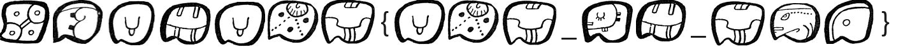

# MOCSCTF2024 - symbol

- Write-Up Author: 菜鳥程序員1號 \[[菜鳥程序員1號](https://github.com/ian-ng)\]

- Flag: MOCSCTF{CTF_IS_FUN}

## Challenge Description:

>this is challenge description
>
>[img](./assets/symbol.png)
>


## Write up  
1. Open the image

- as we know the format of the flag is MOCSCTF{...}
- so we can see some symbols in the image and got
```
MOCSCTF{CTF_?S_F??}
```
- now only 3 characters are missing
- so we can guess some missing characters to get some meaningful word
- then, I can guess the missing characters are I, U, N

2. try with the flag
```
MOCSCTF{CTF_IS_FUN}
```
- and it's correct!
