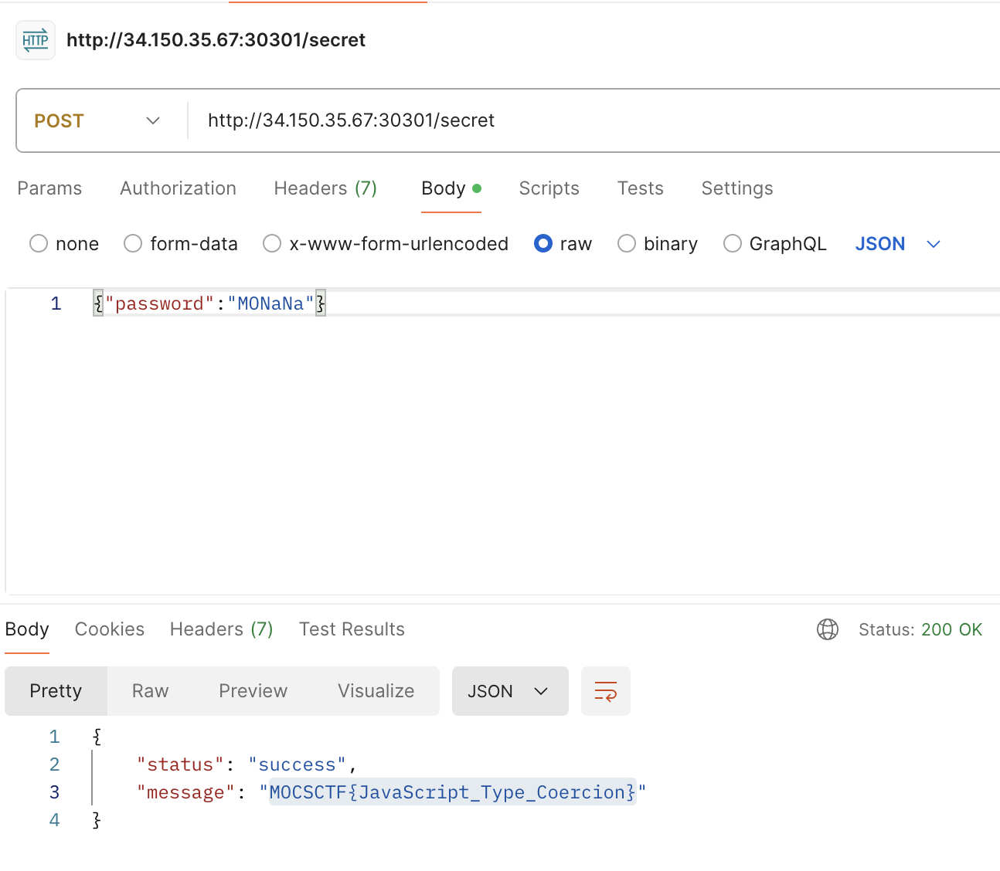

# MOCSCTF2024 - easyJS

- Write-Up Author: 菜鳥程序員1號 \[[菜鳥程序員1號](https://github.com/ian-ng)\]

- Flag: MOCSCTF{JavaScript_Type_Coercion}

## Challenge Description:

>this is challenge description
>
>[file](./assets/index.js)
>

http://34.150.35.67:30301/

## Write up  
1. Open the website
- you will see only the text "Team MOCSCTF-A secret chat" on the website

2. Since nothing useful on the website link, look into the provided js file
- you will see the following code
```javascript
app.post('/secret', (req, res) => {
    const { password } = req.body;
    if (password == "M" + "O" + +"CTF" + "a" ) {
        fs.readFile("./flag.txt", 'utf8', (err, data) => {
            if (err) {
                console.error('Error reading file:', err);
                    res.status(500).send('Error reading file');
            } else {
                    res.json({ status: 'success', message: data});
            }
        });
    } else {
        res.json({ status: 'error', message: 'Wrong Secret!' });
    }
});
```
- Need to focus on the following line
```javascript
if (password == "M" + "O" + +"CTF" + "a" ) {
```
- Since there are **two plus signs (+)**, it will convert the string "CTF" to a number (NaN)
- So the password will be "MO" + NaN + "a" = "MONaNa"

3. I'm use Postman to send a POST request to the server with the password "MONaNa"
- You will get the flag
