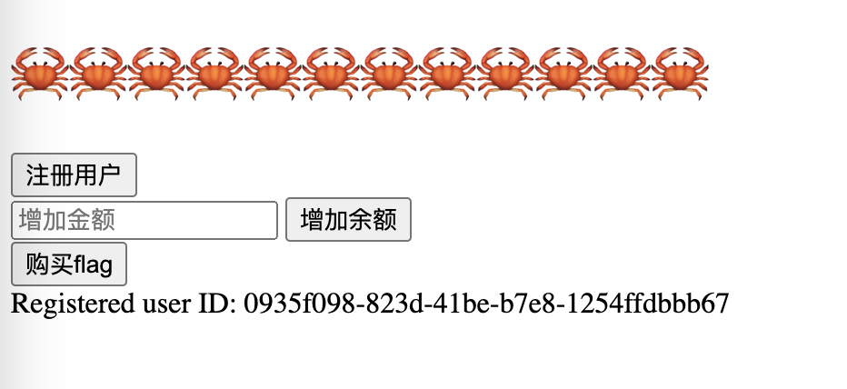
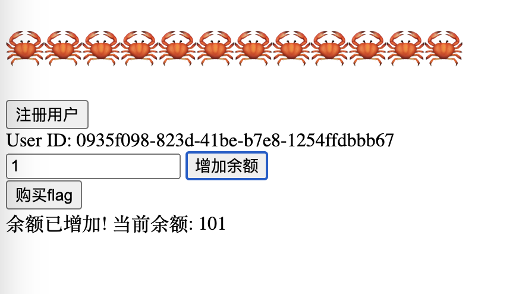
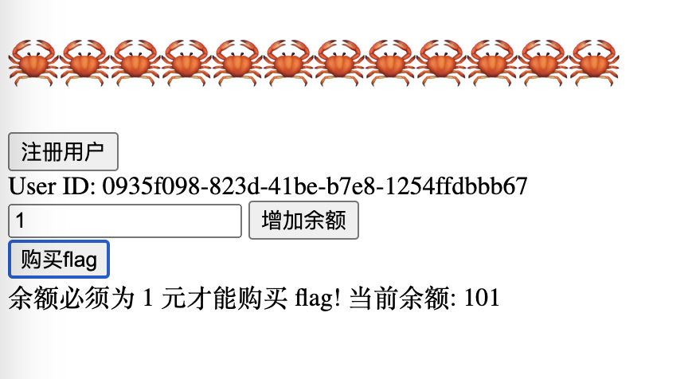
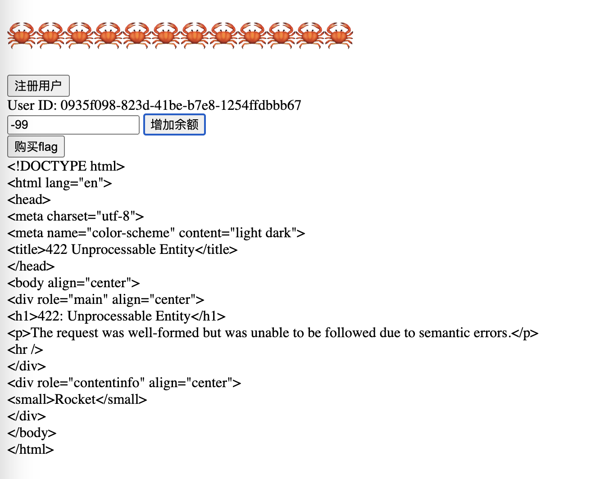
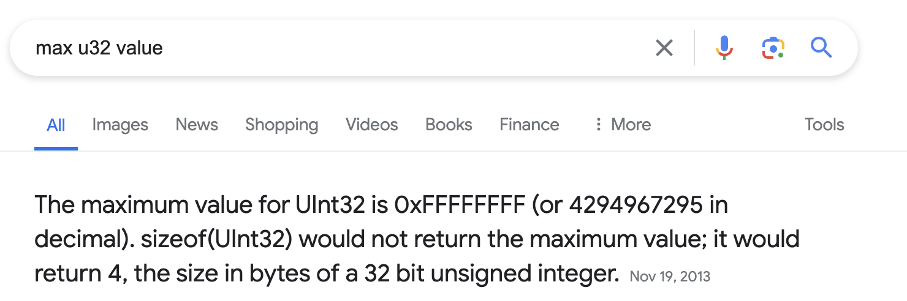
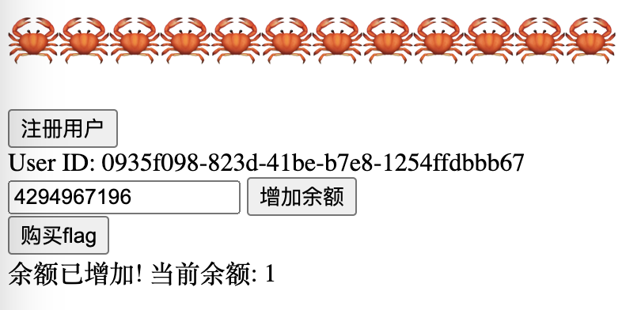
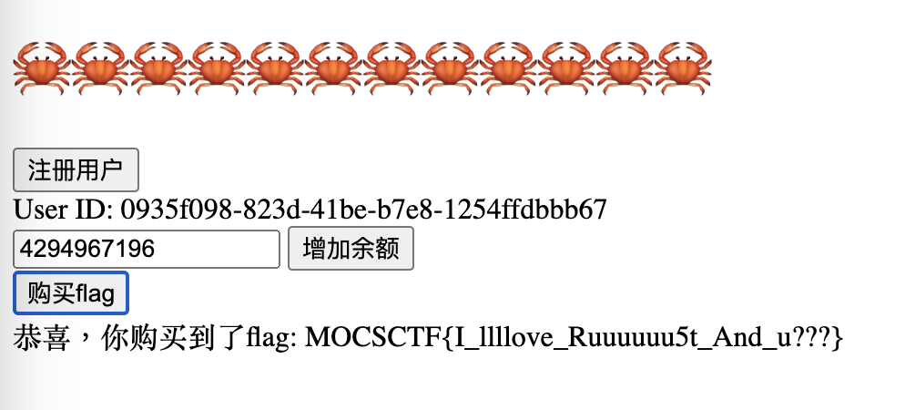

# MOCSCTF2024 - rust-shop

- Write-Up Author: 菜鳥程序員1號 \[[菜鳥程序員1號](https://github.com/ian-ng)\]

- Flag: MOCSCTF{I_llllove_Ruuuuuu5t_And_u???}

## Challenge Description:

>this is challenge description
>
> you have much money but can only buy in 1$
>[file](./assets/main.rs)
>

http://34.150.35.67:30305/start

## Write up  
1. Open the website
- you will see a website with a button "注冊用戶", a text input, a button "增加餘額", and a button "購買flag", and shows the current registered user id


2. input 1 to the text input and click "增加餘額", try what will happen
- you will see that the current balance is become 101


3. try to click "購買flag" and see what will happen
- you will see that you must only buy in 1$, and the current balance is 101


4. try to input a negative number (-99) to the text input and click "增加餘額", see what will happen
- you will see that some error message is shown

- it seems cannot add a negative number to the balance

5. look into the provided rust file
- see the register logic
```rust
#[post("/register")]
fn register(state: &rocket::State<AppState>) -> Json<RegisterResponse> {
    let user_id = Uuid::new_v4();
    let mut balances = state.balances.lock().unwrap();
    let mut attempts = state.add_attempts.lock().unwrap();

    balances.insert(user_id, 100);
    attempts.insert(user_id, 0);

    Json(RegisterResponse {
        user_id: user_id.to_string(),
    })
}
```
- it shows that when you register a new user, it will initialize the balance to 100

- and see the add_balance logic
```rust
#[post("/add_balance", data = "<form>")]
fn add_balance(form: Form<AddBalance>, state: &rocket::State<AppState>) -> String {
    let user_id = match Uuid::parse_str(&form.user_id) {
        Ok(id) => id,
        Err(_) => return "Invalid user ID".to_string(),
    };

    let mut balances = state.balances.lock().unwrap();
    let mut attempts = state.add_attempts.lock().unwrap();

    let balance = balances.entry(user_id).or_insert(100);
    let attempt = attempts.entry(user_id).or_insert(0);

    if *attempt >= state.max_attempts {
        return format!("你已达到增加余额的最大次数! 当前余额: {}", *balance);
    }
    *balance = balance.wrapping_add(form.amount); 
    *attempt += 1;
    format!("余额已增加! 当前余额: {}", *balance)
}
```
- It shows that the balance is added by `balance.wrapping_add(form.amount)`, and the form.amount is the input from the text input. 
- So if it cannot accept a negative number, need to find other ways to make the balance to 1

- and you can that the balance format is 'u32'
```rust
#[derive(FromForm)]
struct AddBalance {
    user_id: String,
    amount: u32,
}
```
- it can use the overflow the integer to make the balance into 1

6. find the maximum value of u32, here I just search on Google and find that the maximum value of u32 is 4294967295 (2^32 - 1) = -1

- since I have already added 1 on step 2, now if want to make the balance to 1, it need to add 4294967196 (4294967196 = 4294967296 - 100)

7. input 4294967196 to the text input and click "增加餘額", see what will happen
- you will see that the current balance is become 1


8. BINGO! now, can click on "購買flag" to buy the flag
- you will see that the flag is shown

